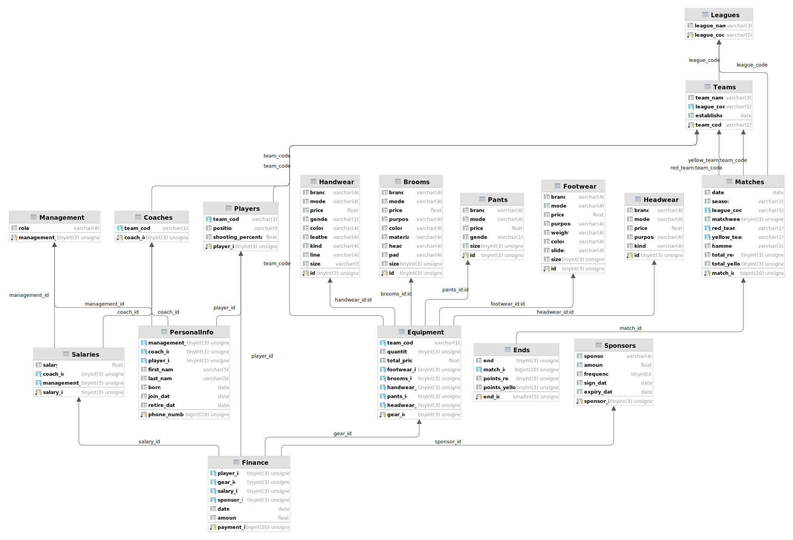

# Curling Club Database

A database scheme for a sports club. Assignment from university course about databases.

## Database scheme

## Data 

All data is generated randomly, but realistically. 
`txt` directory contains names, surnames, teams names that are used to generate data.

## Database

All tables are created, filled with data using python scripts that are in `src` directory. The name of the files indicate the purpose of the script.

Both low level and high level python connectors are used to interact with the database:
* `tables.py` contains the definition of the tables in sql language and `database_creator.py` uses it to create the tables on the side of the server,
* `pandas` `write_to_sql` method is used to fill the tables with data.

`main.py` is the main scipt that glues everything together.

## Requirements

* Python libraries: `requirements.txt`,
* Database server (please fill in the `config.py` file with your database credentials).

## Collaborators

- [Mikołaj Langner](https://github.com/MikolajLangner)
- [Marcin Miśkiewicz](https://github.com/MarcinBear)
